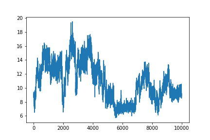
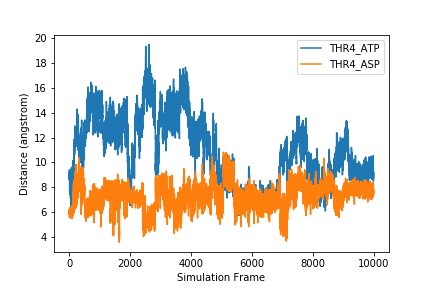
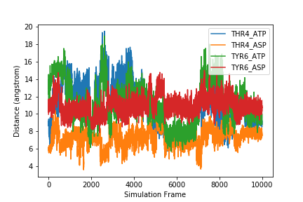
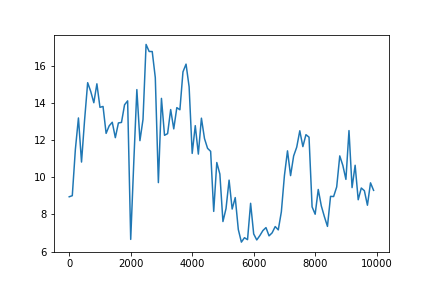
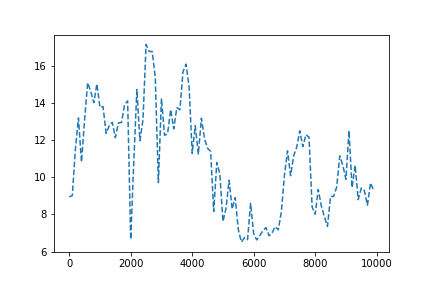
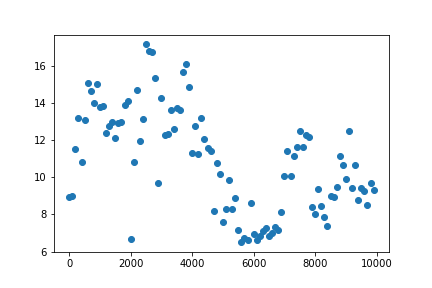
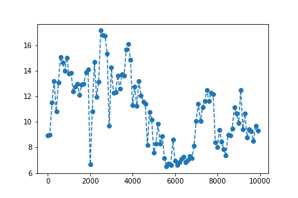
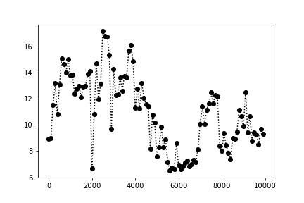

One of the most common ways to present scientific data is through graphs or plots.

> ## Prepare for plotting
> From the previous lesson, remember that you should hav a variable called `data` defined which contains the tabular data in `distance_data_headers.csv`. If you do not have this stored in your `data` variable, here is how to load it.
> ~~~
> import os
>
> distance_file = os.path.join('data', 'distance_data_headers.csv')
> distances = numpy.genfromtxt(fname=distance_file, delimiter=',', dtype='unicode')
> headers = distances[0]
> data = distances[1:]
> data = data.astype(numpy.float)
> ~~~
> {: .language-python}
{: .callout}

## Plotting Data
Another common way to analyze tabular data is to graph it.  To graph our data, we will need a new python library that contains functions to plot data. To plot our data, we will use a Python library called <a href='https://matplotlib.org/index.html'>`matplotlib`</a>.


```
import matplotlib.pyplot
```
{: .language-python}
```
matplotlib.pyplot.figure()     #This initializes a new figure
matplotlib.pyplot.plot(data[:,1])
```
{: .language-python}



`matplotlib.pyplot` is a lot to type every time we make a plot. Often, when people import python modules they give them a shorthand name so that they have to type less. For example, `matplotlib.pyplot` is commonly shortened to `plt`. You'll see this in <a href='https://matplotlib.org/gallery/lines_bars_and_markers/bar_stacked.html#sphx-glr-gallery-lines-bars-and-markers-bar-stacked-py'>official documentation</a> for matplotlib. Let's change our code so we don't have to type this every time.
```
import matplotlib.pyplot as plt

plt.figure()
plt.plot(data[:,1])
```
{: .language-python}


## Labeling plots and saving figures

But what information is our plot showing? We should label our axes and add a legend that tells us which sample this is. We can add x and y labels using the `xlabel` and `ylabel` functions. To add a label so we can use a legend on the plot, we add the `label` keyword to the `plot` function. We may also want to save our plot as an image so we can use it outside of this notebook. To do this, we use the `savefig` function.


```
sample = headers[1]

plt.figure()
plt.xlabel('Simulation Frame')
plt.ylabel('Distance (angstrom)')
fig_1 = plt.plot(data[:,1], label=sample)
plt.legend()

plt.savefig(F'{sample}.png')
```
{: .language-python}


After executing this code, check the directory you are working in. You should have an image called `THR4_ATP.png` that looks like the one displayed above and in your notebook.

To plot more than one data set on the same graph, we just add another plot command.
```
plt.figure()
plt.xlabel('Simulation Frame')
plt.ylabel('Distance (angstrom)')
plt.plot(data[:,1], label=headers[1])
plt.plot(data[:,2], label=headers[2])
plt.legend()
plt.savefig('two_samples.png')
```
{: .language-python}



If we want to plot all samples on the same plot, we can use a `for` loop to loop through all the columns. Here, we put the x and y labels and `savefig` command outside of the `for` loop since those things only need to be done once.


```
for col in range(1, len(headers)):
    fig = plt.plot(data[:,col], label=headers[col])
    plt.legend()

plt.xlabel('Simulation Frame')
plt.ylabel('Distance (angstrom)')
plt.savefig('all_samples.png')
```
{: .language-python}



> ## Exercise
>
>
> How would you make a different plot for each sample? Save each image with the filename `sample_name.png`.
>
>> ## Solution
>> To make a different plot for each sample, move the `plt.figure()` and the `plt.savefig` commands inside the `for` loop.
>> ~~~
>>for col in range(1, len(headers):
>>    plt.figure()
>>    sample = headers[col]
>>
>>    plt.plot(data[:,col], label=sample)
>>    plt.legend()
>>    plt.xlabel('Simulation Frame')
>>    plt.ylabel('Distance (angstrom)')
>>
>>    plt.savefig(F'{sample}.png')
>> ~~~
>> {: .language-python}
> {: .solution}
{: .challenge}

### Plotting with `x` and `y`

The `plot` function creates a line plot. If there is only one argument in the function, it will use that as as the `y` variable, with the `x` variable just being a count.

If we wanted to use the `Frame` column for our `x` value, we would add it as the first argument of the `plot` function. This won't change the graph at all.

```
import matplotlib.pyplot as plt

plt.figure()
plt.plot(data[:,0], data[:,1])
```
{: .language-python}

However, if we did not want to plot every frame, or if the data we were plotting was not sequential, we would have to specify `x` and `y`.

Let's try plotting every 100th frame. To do this we will use a new slicing syntax. To select frames at regular intervals, we can use the syntax `array[start:stop:interval]`.

For example, to get every other row to the 10th row, we would use a start of `0`, and end of `10`, and an increment of `2`. We then use the `:` to get every column.

~~~
print(data[0:10:2, :])
~~~
{: .language-python}

~~~
array([[ 1.    ,  8.9542,  5.8024, 11.5478,  9.9557],
       [ 3.    ,  9.0066,  6.0637, 13.0924, 11.3043],
       [ 5.    ,  9.1294,  5.9365, 13.5321, 10.6279],
       [ 7.    ,  8.8657,  5.9186, 12.9312, 10.2176],
       [ 9.    ,  9.4184,  6.1993, 13.2614, 10.366 ]])
~~~
{: .output}

If you want to go to the end, leave out the `end` variable, and just use two colons `::`.

> ## Check your understanding
> How would you get every 100th point in the first column?
>> ## Answer
>> ~~~
>> incr_100 = data[0::100, 0]
>> ~~~
>> {: .language-python}
>>
>> We have used a `start` of 0, `end` to the end of the array, and an `increment` of `100`. We then got just the first column (column 0 - counting starts at 0!)
> {: .solution}
{: .challenge}

Let's make a plot with every `100` points.

~~~
plt.figure()
plt.plot(data[0::100,0], data[0::100,1])
~~~
{: .language-python}



### Customizing plot appearance
We can change the marker or line type by adding another argument after our `x` and `y` values. For example, we can make our line dashed by adding `'--'`.

~~~
plt.figure()
plt.plot(data[0::100,0], data[0::100,1], '--')
~~~
{: .language-python}



Change the line to a marker

~~~
plt.figure()
plt.plot(data[0::100,0], data[0::100,1], 'o')
~~~
{: .language-python}



Or even combine effects.

~~~
plt.figure()
plt.plot(data[0::100,0], data[0::100,1], '--o')
~~~
{: .language-python}



Here is a list of options you can use.
~~~
character	description
'-'	solid line style
'--'	dashed line style
'-.'	dash-dot line style
':'	dotted line style
'.'	point marker
','	pixel marker
'o'	circle marker
'v'	triangle_down marker
'^'	triangle_up marker
'<'	triangle_left marker
'>'	triangle_right marker
'1'	tri_down marker
'2'	tri_up marker
'3'	tri_left marker
'4'	tri_right marker
's'	square marker
'p'	pentagon marker
'*'	star marker
'h'	hexagon1 marker
'H'	hexagon2 marker
'+'	plus marker
'x'	x marker
'D'	diamond marker
'd'	thin_diamond marker
'|'	vline marker
'_'	hline marker
~~~

You can also change the color using these options.
~~~
character	color
‘b’	blue
‘g’	green
‘r’	red
‘c’	cyan
‘m’	magenta
‘y’	yellow
‘k’	black
‘w’	white
~~~

> ## Check your understanding
> Modify your plot so that you have a black dashed line and circular markers.
>
>> ## Solution
>> ~~~
>> plt.figure()
>> plt.plot(data[0::100,0], data[0::100,1], ':ok')
>> ~~~
>> {: .language-python}
>> 
>> Here we have used `:ok`. `:` tells matplotlib we want a dashed line, `o` tells matplotlib we want circular markers, and `k` says we want the color to be black.
> {: .solution}
{: .challenge}

Matpotlib is highly customizable. What we've shown here is only the beginning of the types of plots you can make. If you would like to make more plots, we strongly recommend you check out the [matplotlib tutorials](https://matplotlib.org/2.1.1/tutorials/index.html) online.
