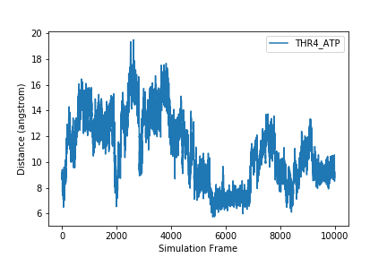

One of the most common ways to present scientific data is through graphs or plots.

## Plotting Data
Another common way to analyze tabular data is to graph it.  To graph our data, we will need a new python library that contains functions to plot data. To plot our data, we will use a Python library called <a href='https://matplotlib.org/index.html'>`matplotlib`</a>.

```
import matplotlib.pyplot
```
{: .language-python}
```
matplotlib.pyplot.figure()     #This initializes a new figure
matplotlib.pyplot.plot(data[:,0])
```
{: .language-python}


`matplotlib.pyplot` is a lot to type every time we make a plot. Often, when people import python modules they give them a shorthand name so that they have to type less. For example, `matplotlib.pyplot` is commonly shortened to `plt`. You'll see this in <a href='https://matplotlib.org/gallery/lines_bars_and_markers/bar_stacked.html#sphx-glr-gallery-lines-bars-and-markers-bar-stacked-py'>official documentation</a> for matplotlib. Let's change our code so we don't have to type this every time.
```
import matplotlib.pyplot as plt

plt.figure()
plt.plot(data[:,0])
```
{: .language-python}

## Labeling plots and saving figures

But what information is our plot showing? We should label our axes and add a legend that tells us which sample this is. We can add x and y labels using the `xlabel` and `ylabel` functions. To add a label so we can use a legend on the plot, we add the `label` keyword to the `plot` function. We may also want to save our plot as an image so we can use it outside of this notebook. To do this, we use the `savefig` function.


```
sample = headers[1]

plt.figure()
plt.xlabel('Simulation Frame')
plt.ylabel('Distance (angstrom)')
fig_1 = plt.plot(data[:,1], label=sample)
plt.legend()

plt.savefig(F'{sample}.png')
```
{: .language-python}



After executing this code, check the directory you are working in. You should have an image called `THR4_ATP.png` that looks like the one displayed above and in your notebook.

To plot more than one data set on the same graph, we just add another plot command.
```
plt.figure()
plt.xlabel('Simulation Frame')
plt.ylabel('Distance (angstrom)')
plt.plot(data[:,0], label=headers_noframe[0])
plt.plot(data[:,1], label=headers_noframe[1])
plt.legend()
plt.savefig('two_samples.png')
```
{: .language-python}


If we want to plot all samples on the same plot, we can use a `for` loop to loop through all the columns. Here, we put the x and y labels and `savefig` command outside of the `for` loop since those things only need to be done once.


```
for col in range(len(data[0,:])):
    fig = plt.plot(data[:,col], label=headers_noframe[col])
    plt.legend()

plt.xlabel('Simulation Frame')
plt.ylabel('Distance (angstrom)')
plt.savefig('all_samples.png')
```
{: .language-python}


> ## Exercise
>
>
> How would you make a different plot for each sample? Save each image with the filename `sample_name.png`.
>
>> ## Solution
>> To make a different plot for each sample, move the `plt.figure()` and the `plt.savefig` commands inside the `for` loop.
>> ~~~
>>for col in range(len(data[0,:])):
>>    plt.figure()
>>    sample = headers_noframe[col]
>>
>>    plt.plot(data[:,col], label=sample)
>>    plt.legend()
>>    plt.xlabel('Simulation Frame')
>>    plt.ylabel('Distance (angstrom)')
>>
>>    plt.savefig(F'{sample}.png')
>> ~~~
>> {: .language-python}
> {: .solution}
{: .challenge}
