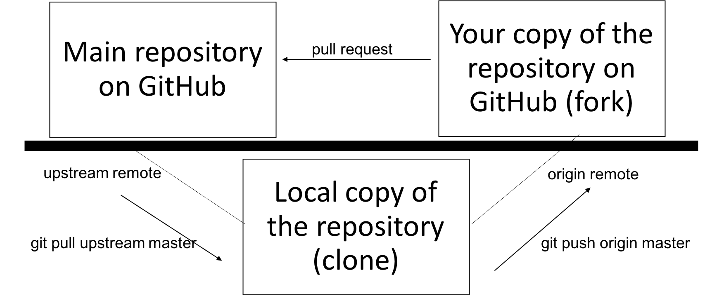

## Version Control
Have you ever been working on a project and wanted to go back to a previous version of the project?  Or perhaps you've worked on a group project where multiple people were making changes to files and you ended up with multiple versions of multiple files and it was very confusing?  Now imagine that you are working on a software project with 5, 10 or even 100 people.  Every person would need their own copies of all the code, but it would be very hard to keep up with the changes each person was making and merge them all together.  All of these issues can be handled by using *version control* on your project.  

Version control keeps a complete history of your work on a given project. It facilitates collaboration on projects where everyone can work freely on a part of the project without overriding others’ changes. You can move between past versions and rollback when needed. Also, you can review the history of your project through commit messages that describe changes on the source code and see what exactly has been modified in any given commit. You can see who made the changes and when it happened.

This is greatly beneficial whether you are working independently or within a team.

## git and GitHub
The software package `git` is one of the most popular software packages for version control.  [GitHub](https://github.com/) is an online hosting service which hosts the files of many software packages that use git so that these packages can be shared with other people.  Anyone can use git locally for version control without using GitHub.  To share your code on GitHub, you must create a GitHub account and profile.  

> ## Installing git
> Git is automatically installed on most modern Mac OS.  If you installed the full version of anaconda, it was also already installed.  If you are unsure if git is installed on your machine, go to the Terminal window and type
> ~~~
> $ which git
> ~~~
>
> If you have git installed it will show you the installation location, usually
> ~~~
> /usr/bin/git
> ~~~
> If you do not have git installed already, you can install it with conda.  Go to your terminal window and type
> ~~~
> $ conda install -c anaconda git
> ~~~
> You will need to open a new terminal window to start using git.
{: .callout}

## Initializing git on your project
In git, a collection of files related to a specific project is called a *respository*.  In the Terminal window, navigate to the folder where you wrote your geometry analysis program.  Once you are in the correct folder, type
```
$ git init
```
{: .input}

After you type this command, git will initialize an empty repository.  Now you need to add files to your repository.  In the Terminal window, type
```
$ git add .
```
The `.` in the git add statement says to add everything in the current folder to the repository.  If you don't want to add everything, don't put the `.` and instead just list the specific files you do want to include.  

Oddly, `git add` doesn't add the files to your repository.  It really just tells git which files you want to add.  This is called *staging*. To finish adding the files to the repository, you have to *make a commit*.

## Making commits
Once you have staged a file to add to your repository, you commit it to the repository.  In the Terminal window, type
```
$ git commit -m "Initial commit to the test repository."
```
Every time you make a commit, this is now part of the official record of what is in the repository, so you have to write a commit message telling people what is being added.  You can write anything you want in these comments, but the best practice is to write something short but descriptive about the files that are being added or changed.  Even if you think no one else is ever going to use your code, writing good commit messages is a great way to remind yourself of what you have done in the past.  It is not a good practice to have your commit messages be non-descriptive like "Commit #5."

> ## Using git status
> If you are working with git, at any time you can type
> ~~~
> git status
> ~~~
> and git will tell you what you have done.  For example, git status can identify files in the directory that have not yet been added or remind you that you have staged files for a commit but that you haven't actually committed them yet. It can identify only the files that have changed since your last commit.  If you ever lose track of what you are doing or where you are in the process with git, use `git status`!
{: .callout}

## Putting your code on GitHub
Let's get your project put on GitHub so you can share it with others.  In your browser, navigate to github.com.  If you already have a GitHub account, click the Sign In button.  If you need to create an account, click the Sign Up button.  

> ## Choosing your GitHub username
> To create a GitHub account, all you need is a valid e-mail address and to choose a GitHub username, which will be public.  It is now *very* common in many technical disciplines for potential research advisors or employers to look at your GitHub page to see what kind of projects you have contributed to and what kind of work you have done.  Consequently, you want to choose a recognizable, professional username and always keep your GitHub profile up-to-date and professional.
{: .callout}

Once you are signed in to GitHub, on the left side of the page, click the green button that says New to create a new repository.  On the next page, choose a name for your repository and write a short description of your project.  You can choose whether your repository will be public or private.  Even if you choose private, you can identify other specific GitHub users who can see your repository and commit to it.  However, if you want other people to be able to find your project without you specifically sharing it with them, you should choose public.

Note the last question, “Initialize this repository with a README”.  We will leave this unchecked in our case because we have an existing repository we are adding to GitHub. If you were creating the repository for the first time on GitHub, you would select this.  There are also options for adding a .gitignore file or a license, but you don't have to do that right now.  

Click Create repository.

On the next page, GitHub now very helpfully gives us directions for how to get our code on GitHub.  The most relevant set of instructions for our current situation is the third set **push an existing repository from the command line**.  

Before we follow these directions, let’s look at a few things in the repository. When you want to be able to put your code online in a repository, you have to add what git calls remotes. Currently, our repository has no remotes, so the first line helps us create our remote.  In the Terminal window, type

```
$ git remote add origin https://github.com/YOUR-USERNAME/REPOSITORY-NAME.git
$ git push -u origin master
```
Note that the URL in your first command will be different because it will contain your own GitHub username and repository name.  Just copy the line that GitHub gives you.  Note that you will need to enter the first command, press enter, and then enter the second command. The first command adds a remote named origin and sets the URL to our repository. The second command pushes our repo to where we have set as origin. The word master means we are pushing the master branch.

Now if you refresh the GitHub webpage you should be able to see all of the new files you added to the repository.

## Adding a README.md file

If your repository contains a file named `README.md` then GitHub renders it into a nice description so that anyone who comes across your repo knows what the project is about.  

> ## Exercise
>
> In your favorite text editor, create a new file called `README.md` and write a description of your geometry analysis code and how it works.  If you want to have section headings in your file, use ## to indicate a section heading.  Otherwise, just type in your description.
>
> Make sure you save your file in the folder with the rest of your project.   Using the git commands learned above, add the file to your repository, commit it with an appropriate commit message, and push it to the master branch of your GitHub repository.
>
>> ## Solution
>> In a text editor, create a new file called `README.md`.  An example:
>> ~~~
>> ## Geometry analysis project with testing
>>
>> This repository contains a code that measures distances between atoms, determines if these atoms qualify as a bond, and outputs the list of bond lengths.  This project also features testing for all of the functions in the code.
>> ~~~
>>
>> Next, use git status to see what you are doing.  In a Terminal window
>> ~~~
>> $ git status
>> ~~~
>> {: .input}
>> ~~~
>> On branch master
>> Your branch is up to date with 'origin/master'.
>>
>> Untracked files:
>>   (use "git add <file>..." to include in what will be committed)
>>
>> 	README.md
>> ~~~
>> {: .output}
>>
>> This use of git status shows us that a new file (the README.md file) that is not being tracked by git has been added to our files.  Now we need to add the README.md file and commit it.  
>>
>> ~~~
>> $ git add README.md
>> $ git commit -m "Added a README file describing the project."
>> ~~~
>> {: .input}
>> ~~~
>> [master 7897fcc] Added a README file describing the project.
>>  1 file changed, 3 insertions(+)
>>  create mode 100644 README.md
>> ~~~
>> {: .output}
>>
>> Finally, push to the master branch on GitHub.
>>
>> ~~~
>> $ git push origin master
>> ~~~
>> {: .input}
>>
>> ~~~
>>  Counting objects: 3, done.
>> Delta compression using up to 4 threads.
>> Compressing objects: 100% (3/3), done.
>> Writing objects: 100% (3/3), 481 bytes | 481.00 KiB/s, done.
>> Total 3 (delta 1), reused 0 (delta 0)
>> remote: Resolving deltas: 100% (1/1), completed with 1 local object.
>> To https://github.com/armcdona/learning_python_gittest.git
>>    66e9113..7897fcc  master -> master
>> ~~~
>> {: .output}
>{: .solution}
{: .challenge}

Now if you refresh the GitHub page for your project, you will see your project description at the bottom of the page.  That's it!  Your code is now on GitHub for the world to see, download, and use!

> ## Time Check
>
> If you are running out of time, this is a good place to end the lesson.  Especially if the GitHub lesson is the last lesson being covered in the workshop, this is a good place to stop.
{: .callout}

## Collaborating with others using GitHub

Many software projects, large and small, are hosted on GitHub.  If you are working with other people on a project, they may ask you to collaborate and contribute your code contributions through GitHub.  To do this, we need to understand a little more the flow of information on GitHub.  

As discussed above, a collection of files for a certain project is called a *repository* on GitHub.  When you are collaborating with others on a project, there are at least three relevant copies of a repository:  the main repository on GitHub, your copy of the repository on GitHub, and the local copy of the repository on your computer.



### Forking a repository
To make your copy of the repository on GitHub, you *fork* the main repository.  Navigate to the GitHub page of the project.  In the upper right hand button, click the button that says **Fork**.  This will make a copy of the repository on *your GitHub account*.  

### Cloning a repository
Now you need copy the repository on *your GitHub* to your local computer.  This is called a *clone*.  Navigate to the GitHub page of *your copy* of the repository on GitHub. Click the green button that says Clone or Download.  Copy the link in the box.

Now open a terminal window and navigate to the location where you want the repository to be stored on your local computer.  
Type `git clone` and then paste the link you copied.
```
$ git clone https://github.com/YOUR-USERNAME/REPOSITORY-NAME.git
```
where the username will be your GitHub username and the repository name will be the name of the repository.  This command will create a folder with the same name as the repository that will be under git control.  

### Setting git remotes
Now that you have all the copies of the repository in place, you need to make connections between the copies so you can transfer information.  These connections between the copies are called *remotes*.  When you clone a repository, it automatically sets up one remote for you called *origin*.  To see the remotes for a repository, go to the command line and type
```
$ git remote -v
```
```
origin	https://github.com/YOUR-USERNAME/REPOSITORY-NAME.git (fetch)
origin	https://github.com/YOUR-USERNAME/REPOSITORY-NAME.git (push)
```
Since we cloned the repository from our copy on GitHub, the *origin* remote is between our copy on GitHub and the local copy on our computer.

We probably also want to connect the repository on our local computer to the main repository on GitHub so that we can get updates that are made to that repository.  We need to create a new remote called *upstream* that connects the repository on our local computer to the main repository on GitHub.  You can actually name any remote anything you want, but *upstream* is the accepted name for the remote to the original main repository.

To set a new remote, go to GitHub and navigate to the page of the main repository (not your copy, the same page you forked from). Click the green button that says Clone or Download.  Copy the link in the box.

Go to the terminal and type `git remote add upstream` and then paste the link you copied.
```
$ git remote add upstream https://github.com/ORIGINAL_OWNER/ORIGINAL_REPOSITORY.git
```
Now if you use `git remote -v` again to list your remotes, you should see two remotes, origin (to your copy on GitHub) and upstream (to the main repository on GitHub).
```
$ git remote -v
> origin    https://github.com/YOUR_USERNAME/YOUR_FORK.git (fetch)
> origin    https://github.com/YOUR_USERNAME/YOUR_FORK.git (push)
> upstream  https://github.com/ORIGINAL_OWNER/ORIGINAL_REPOSITORY.git (fetch)
> upstream  https://github.com/ORIGINAL_OWNER/ORIGINAL_REPOSITORY.git (push)
```

### Information flow using GitHub

The normal workflow when you are working on a collaborative project with git is:
1.  Pull changes to the main project from upstream.
2.  Work on the project on your local copy of the repository.
3.  Commit your changes to your local copy.
4.  Push your changes to your copy of the repository on GitHub.
5.  Submit your changes to the main developers so they can consider including them in the main repository.  

#### Getting changes from the main repository

To get changes from the main repository into your local repository, you use the upstream remote and use the `pull` command.
```
$ git pull upstream master
```
When you enter this command, several things can happen, depending on what changes have been added to the main repository.  If the new changes don't conflict with what you have already, then you might see something that says `Fast Forward`.  If there are conflicts, you will have a merge conflict that you need to resolve, where you select which version of the file you want.

> ## Pull vs. fetch and merge
>
> The `pull` command is actually a combination of two other git commands `fetch` and then `merge`.  The `pull` command is easier because it is just one step, but in complex situations you might want to do a `fetch` so you can see what changes have been made and then decide to `merge` or not.
{: .callout}

#### Pushing changes to your repository on GitHub

Suppose you have made changes to your project and you are now ready to put them on GitHub.   First you need to use `git add` and `git commit` as discussed above to save all your changes to git.  Then you need to push your changes through the origin remote to your repository on GitHub.
```
git push origin master
```
Generally, you can not push your changes upstream into the main repository on GitHub.  This is why you need your own fork on GitHub; you can always push to something that belongs to you, but not something that belongs to someone else.  

> ## Being a Collaborator
>
> There are ways that you can push upstream to the main repository.  The owner of a repository can add you as a *collborator* and give you permission to push changes.  For small projects with only a few people, this is fairly common.  For large projects with 100's of developers, no one does this, and you must submit your changes through a *pull request* as described below.
{: .callout}

Notice that in this flow of information, if you want to pull new changes from the main repository into your repository on GitHub, there is no remote that directly connects those two.  To accomplish this, you would do a `pull` from the main repository to the copy on your local computer through the upstream remote and then do a `push` from your local copy to your copy on GitHub through the origin remote.

#### Submitting your changes to the main developers

Once you have pushed changes to your repository on GitHub, you may want to tell the main developers about your changes and ask them to consider merging them into the main repository.  This is called making a *pull request*.  Essentially, you are suggesting to the developers that they pull changes from your repository into their repository.   To make a pull request, navigate to the GitHub page of the main repository and click on Pull Request in the navigation bar across the top.  On the next page, click the green button that says New Pull Request.

On the next page, in the left box that says *base*, the main repository should be listed.  If it is not, use the dropdown menu to select it.  In the right box that says *compare*, use the dropdown menu to select your repository.  If you don't see it in the list, then you need to click the blue link above the boxes that says *compare across forks*.  Click *Create Pull Request*.  

On the next page, you will type a message to the developers telling them what changes you have made.  You can also suggest reviewers for your lesson.  When you are finished, click *Create Pull Request*.

The developers will receive a notification of your pull request and then they can review your changes and decide if they are going to merge them into the main repository.  You will receive a notification letting you know if/when the pull request has been merged.  

### Using branches

Within a repository, you can actually create different copies of your code.  These are called *branches*.  This is particularly useful if you want to work on a new feature, but you want to keep another copy of the code that is working in case you mess something up.  In all of the examples above, we have been using the main or *master* branch.  If you are pushing changes to a different different branch, you would replace *master* with the name of that branch.  
